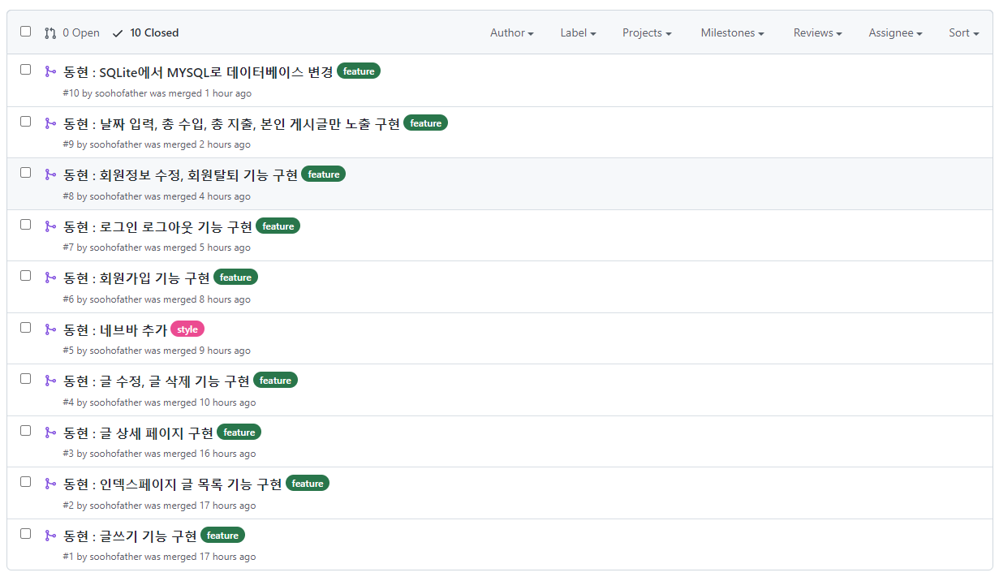
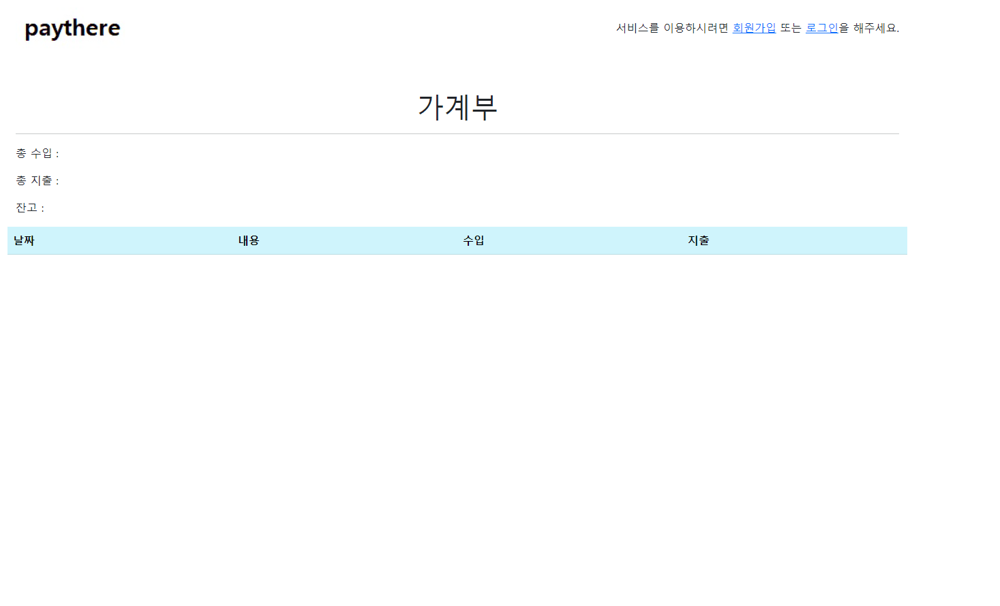
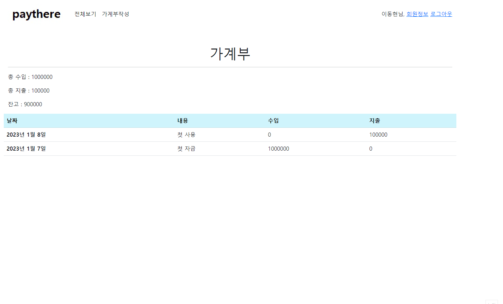
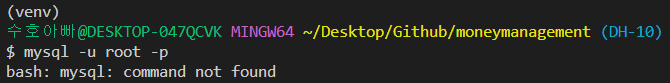
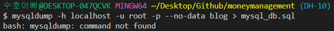

# 프로젝트 목표

- 고객은 이메일과 비밀번호 입력을 통해서 회원 가입을 할 수 있습니다.

- ~~고객은 회원 가입이후, 로그인과 로그아웃을 할 수 있습니다.~~

- 고객은 로그인 이후 가계부 관련 아래의 행동을 할 수 있습니다.
  - ~~가계부에 오늘 사용한 돈의 금액과 관련된 메모를 남길 수 있습니다.~~
  - ~~가계부에서 수정을 원하는 내역은 금액과 메모를 수정 할 수 있습니다.~~
  - ~~가계부에서 삭제를 원하는 내역은 삭제 할 수 있습니다.~~
  - ~~가계부에서 이제까지 기록한 가계부 리스트를 볼 수 있습니다.~~
  - ~~가계부에서 상세한 세부 내역을 볼 수 있습니다.~~
  - 가계부의 세부 내역을 복제할 수 있습니다.
  - 가계부의 특정 세부 내역을 공유할 수 있게 단축 URL을 만들 수 있습니다. (단축 URL은 특정 시간 뒤에 만료되어야 합니다.)

- ~~로그인하지 않은 고객은 가계부 내역에 대한 접근 제한 처리가 되어야 합니다.~~

# 구현

- DB 관련 테이블에 대한 DDL 파일을 소스 디렉토리 안에 넣어주세요.

- 가능하다면 테스트 케이스를 작성해주세요.
- 별도의 요구사항이 없는 것은 지원자가 판단해서 개발합니다.
- JWT 토큰을 발행해서 인증을 제어하는 방식으로 구현해주세요
- 비밀번호는 암호화되어 저장되어야 합니다.

# 권장 사용 언어 및 라이브러리

- 언어 및 프레임워크는 아래와 같이 제한합니다.
  - Django, FastAPI
- DB는 `mysql:5.7` 로 제한합니다.

# 프로젝트 시연

- 프로젝트 깃허브 : https://github.com/soohofather/moneymanagement
  - 각각의 기능이 추가 될 때마다, 브랜치를 따서 master와 머지하는 방법으로 진행하였다.

- 회원가입, 로그인, 로그아웃, 회원정보 수정, 회원 탈퇴 기능구현

  

- 가계부 작성, 수정, 내용보기, 삭제 구현 기능구현

  - 입력날짜 최신순 정렬
  - 입력 된 총 수입 금액, 입력 된 총 지출 금액, 잔고 정보 제공

  

- 본인이 작성한 글만 확인됨, 로그인 안되면 서비스 이용 불가

  

- MYSQL 연동 

  

  

# 이번 프로젝트 소감

1. 우선 첫번째 고비..지난 교육과정에서 MYSQL을 배우지 않아서 이번에 연동을 구글링하며 처음으로 MYSQL을 경험해보았다.. 일단 겨우 겨우 연동 시키긴했는데.. 왜 터미널에서 명령어가 안먹는건지.. 계속 검색하고 검색하였지만.. 결국 찾지 못하였다..후..찝찝한 상태..

2. 두번째 고비는 E-mail 인증이다. 지난 프로젝트때, 다른조에서 이메일 로그인 시연을 한 것을 보았을때는 이렇게 복잡할 것이라고 미처 생각하지 못하였다. 구글링을 해본 결과 allauth를 사용하는건데, 하루만 더 시간이 있으면 더 깊이 파는데.. 오히려 더욱 프로젝트 자체를 망가뜨리고있어서.. 결국 버전 되돌리기로 돌려놓고.. 마무리 하기로 결정하였다.. allauth를 사용해서 안이쁜 폼에서 가입하고 로그인 하는 것은 하였지만, userabstrat와  연동시키고 싶었는데 그 과정에서 점점 둘다 안되는 상황까지 갔었다.. 
3.  이번 프로젝트로 실무적으로 얼마나 실력이 부족한지에 대해서 깨달았다.. DRF는 해야지 해야지 했는데 결국 과정 끝나고 지금 2주가 넘게 지났는데..손도 못대고있었고..  django에서 딱 배웠던 것만 할 줄 아는 그 수준.. 그래도 무엇이 부족한지 어떤것이 실무적으로 필요한지에 대해서 조금 더 알게 되었으니.. 지금부터라도 실력을 키워나가자!